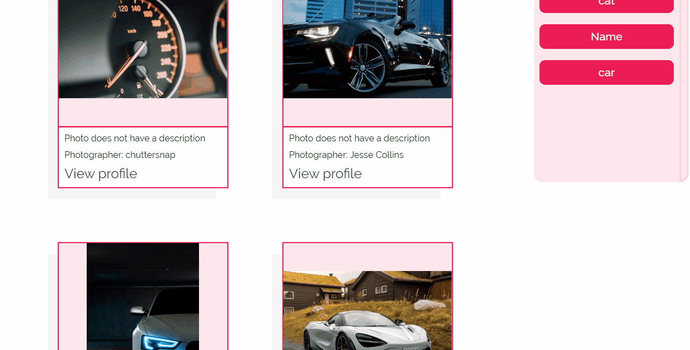

# Unsplash Searcher

This is a website that allows you to search photos from unsplash by keywords and store your searched queries, so you can search them instantly again when wanted.

## How to start

All required packages are already in the project. To start the project type in the script command `npm start`  
This will open [http://localhost:3000](http://localhost:3000) to view the website in the browser.

## Functionalities
 
* Search Unsplash photos by typing in keywords in input field 
* Multiple queries are supported, just type in your keywords seperated by a whitespace 
* You can press the save query button, to save your query
* If you have already saved queries before, simply clicking on them will search the query and display the photos
* If no image has the keywords, a "No results found" message will appear  
* When images are found, they will be displayed in a grid with their description, Photograher and a link to the Photographers Unsplash profile
* While loading, a loading text will appear (***this function sadly does not work, as the request are too fast for a hooks state to change its values and for that reason the loading state doesnt change***) 

## Examples of use

***Searching by keywords***

***Searching using queries***

## Technologies

This web application was implemented using:
1. ReactJS - projects framework
2. Redux - for storing users queries
3. scss - for styling components

## Other information

[Unsplash Guidelines](https://help.unsplash.com/en/articles/2511245-unsplash-api-guidelines)
